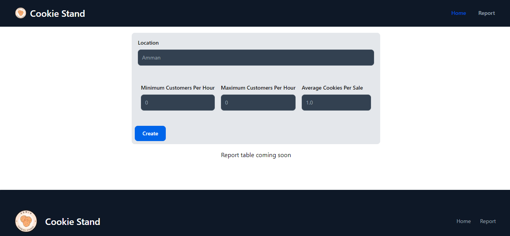
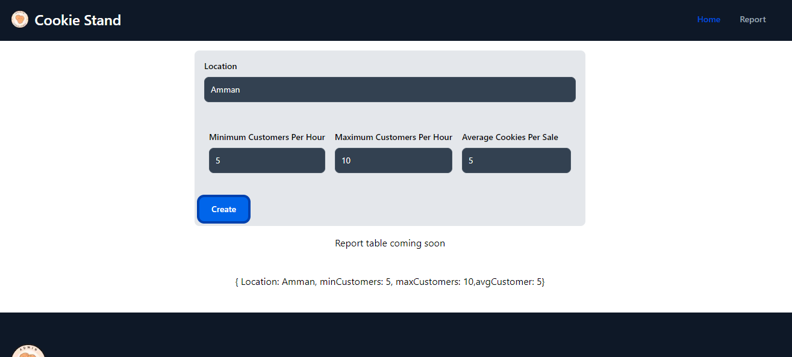
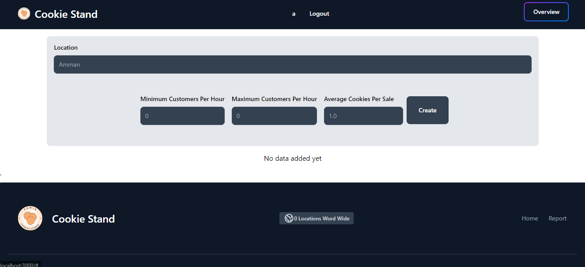
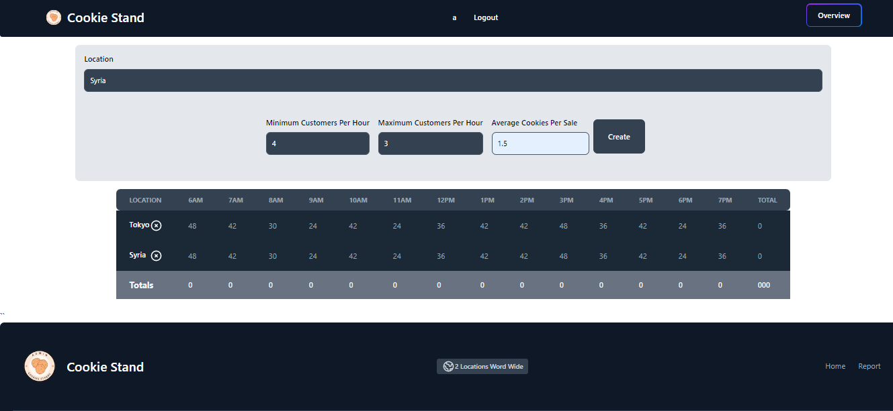
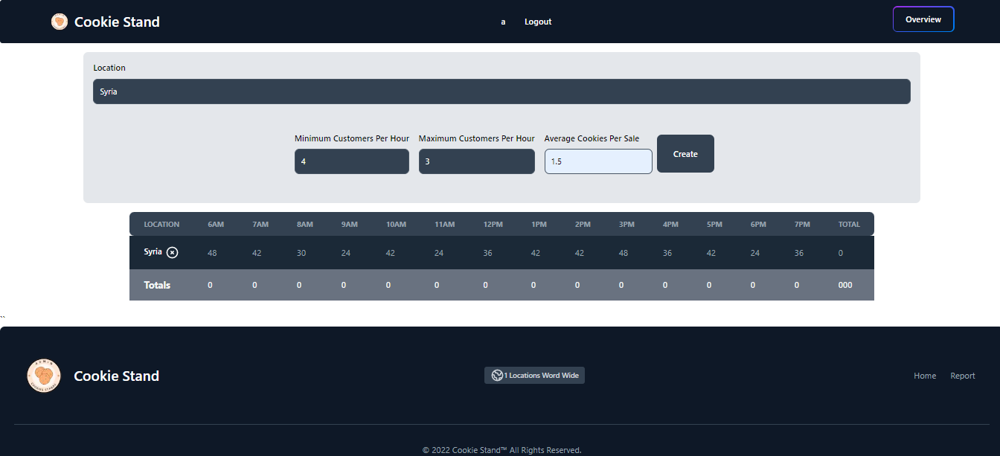

# Getting Started

First, run the development server:

```bash
npm run dev
# or
yarn dev
```

Open [http://localhost:3000](http://localhost:3000) with your browser to see the result.

## In app V1




## In app V1.2







## Contribute with

[Yousef](https://github.com/Yousef-010)

## Recurses

[Login Form](https://twitter.com/framansi)
